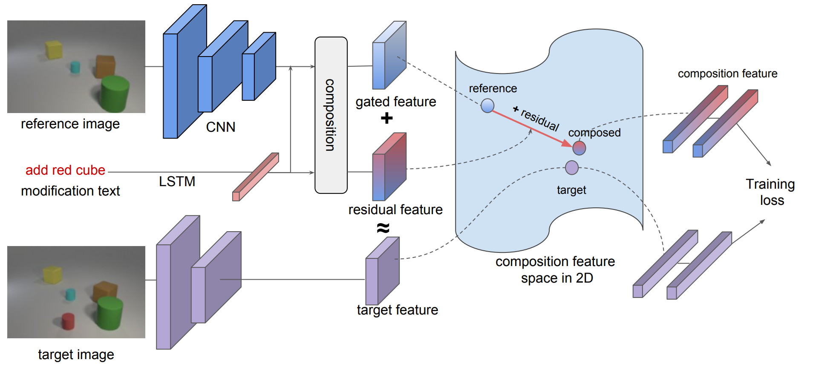
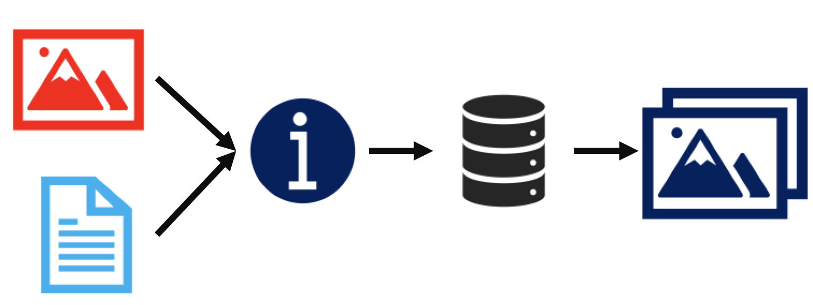
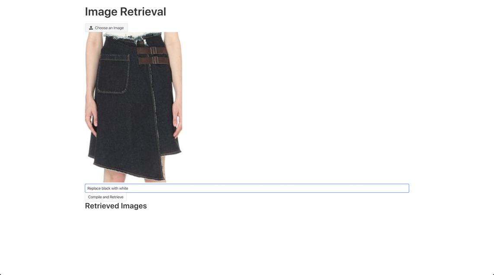
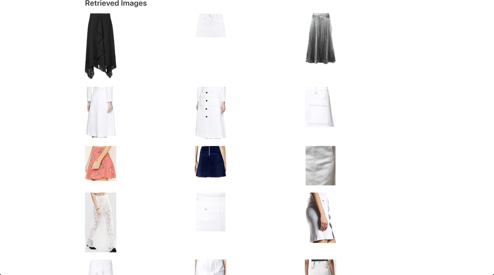

# COMP_SCI496-SML Project - Image Retrieval

## Problem Statement

Similar to searching information in the form of text, the task of image retrieval is to find information in the form of image that convey a certain concept a user has in mind. Such concept can be expressed purely through text, a similar image, or a combination of both. A good image retrieval system can be useful in various scenarios. For example, a customer shopping for some clothes can upload an image resembling what he/she wants, and then add some potential adjustments to the uploaded image. The system will find the closest image representing the cloth he/she desires.



## Input/Output



**Input**

- An image
- An adjustment text

**Output**

- A set of retrieved images

## Core Model

The front-end demo app is built on top of [tirg](https://github.com/google/tirg), whose idea is to formulate a query representation by composing vectorized image and text information. The vectorized image features are filtered using the text information so that only relevant image information is kept, whereas the all text features are retained. This model is proven to be relatively accurate on the [CSS3D](https://drive.google.com/file/d/1wPqMw-HKmXUG2qTgYBiTNUnjz83hA2tY/view) dataset, but for more real life dataset such as [Fashion200K](https://github.com/xthan/fashion-200k), which is also used in this project, there is still room for improvement.

## Deliverables

- [Code for pre-trained model loading](https://github.com/timoderbeste/comp_sci496-sml_homework/blob/848d9911fb2ce0d0cbfd483fe01d50c9abedff38/backend/query.py#L39)
- [Code for dataset loading and preparation](https://github.com/timoderbeste/comp_sci496-sml_homework/blob/848d9911fb2ce0d0cbfd483fe01d50c9abedff38/backend/query.py#L48)
- [Code for pretrained model evaluation](https://github.com/timoderbeste/comp_sci496-sml_homework/blob/master/backend/run_test.py#L11)
- [Code for single batch query execution](https://github.com/timoderbeste/comp_sci496-sml_homework/blob/848d9911fb2ce0d0cbfd483fe01d50c9abedff38/backend/query.py#L18)
- [Commandline interface for querying image indices](https://github.com/timoderbeste/comp_sci496-sml_homework/blob/848d9911fb2ce0d0cbfd483fe01d50c9abedff38/backend/query.py#L65)
- [RESTful API for querying implemented with Flask](https://github.com/timoderbeste/comp_sci496-sml_homework/blob/master/backend/query_service.py)
- [Simple Demo app for image retrieval using React](https://github.com/timoderbeste/comp_sci496-sml_homework/tree/master/frontend)
- [Docker image for backend service](https://hub.docker.com/repository/docker/timoderbeste/tirg-backend) (Use tag v3)
- [Docker image for frontend demo](https://hub.docker.com/repository/docker/timoderbeste/tirg-frontend) (Use tag v1)
- A set of instructions for training with custom dataset (not included by the original project).

## Running through Docker Containers

This project is most easily run through docker containers. Simply follow the steps listed below.

### 1. Pull docker images for frontend and backend

```bash
docker pull timoderbeste/tirg-backend:v3
```

```bash
docker pull timoderbeste/tirg-frontend:v1
```

### 2. Download and unzip prepared data/model file

Click [here](https://northwestern.box.com/s/2mhdtts9q2jef8681iqjew7db8ux5y21) to download `datamodel.zip`. Then unzip it to a preferred directory such as`/Users/timowang/Desktop/datamodel/`. Lastly, set an environment variable as follows:

```bash
export DATAMODEL=/path/to/datamodel
```

Using the example directory, the export statement looks like follows:

```bash
export DATAMODEL=/Users/timowang/Desktop/datamodel/
```

### 3. Run docker containers and start servers

First, run the `tirg-backend` container. Here, we forward container port number 80 to host port 80 and also mount the datamodel directory onto the container. Here, notice that tag `v3` is used. 

```bash
docker run -dit -p 80:80 --name tirg-backend -v $DATAMODEL:/datamodel timoderbeste/tirg-backend:v3 /bin/bash
```

Then, run the `tirg-frontend` container. Here, we forward container port number 3000 to host port 3000. 

```bash
docker run -dit -p 3000:3000 --name tirg-frontend timoderbeste/tirg-frontend:v1 /bin/bash
```

Lastly, execute `run_backend.sh` and `run_frontend.sh` in the `tirg-backend` and `tirg-frontend` containers, respectively. 

```bash
docker exec tirg-backend /bin/bash /run_backend.sh
```

```bash
docker exec tirg-frontend /bin/bash /run_frontend.sh
```

### 4. Launch a browser and start exploring

Enter `localhost:3000` in your brower's address bar, and you will be shown an interface similar to below. You can upload an image of a cloth, and then enter some description (the description field CANNOT be empty). After you hit `Compile and Retrieve`, a few similar images of clothes should be retrieved and displayed. 


Currently, the `Fashion200K` dataset only has female clothes. However, it is also possible to build your own dataset and train a model for it. 





## Model Training

**No training** has been done for this project as a pretrained model for the `Fashion200K` dataset was available. However, it would definitely be possible to construct a new dataset and train a new model with it. Here, a brief set of instructions will be given. 

### Dataset Construction

#### 1. Implement a derived dataset class

The [tirg](https://github.com/google/tirg) project is implemented with extension of dataset kept in mind. Particularly, the abstract class `BaseDataset` defined in `datasets.py`, which can be found [here](https://github.com/google/tirg/blob/4d9fb23511e34bc180cb7551e4414eb2f938fc84/datasets.py#L28), specifies a set of methods that must be implemented by its derived class, such as `Fashion200k` class.

Those methods that must be implemented are:

- `get_all_texts`: it returns a list of `str`, where the $i^{th}$ text corresponds to the description for the $i^{th}$ image in `imgs`. 
- `__getitem__`: it returns an example, which is a `dict` object, with the following information. You could either handbuild examples conforming to the content below, or you could implement a function to do it automatically. The key is how to efficiently create `mod` text for each example. `mod` is the text representing the adjustment to be done to the source image. 
  - `source_img_id`  (`int`)
  - `source_img_data`  (`PIL.Image`)
  - `source_caption`  (`str`)
  - `target_img_id`  (`int`)
  - `target_img_data` (`PIL.Image`)
  - `target_caption`  (`str`)
  - `mod` (`str`): you could either handbuild it, or you could create a function that compares `source_caption` and `target_caption` to automatically generate one. You could refer [here](https://github.com/google/tirg/blob/4d9fb23511e34bc180cb7551e4414eb2f938fc84/datasets.py#L364) as an example. 
- `generate_random_query_target`: it returns  a random example, whose content should be the same as the one listed for `__getitem__`. The difference is that in `__getitem__` the example is determined by its `idx`. In the case of `generate_random_query_target`, it can be any example. 
- `get_img`: it returns either a raw image, i.e. a `PIL.Image` object, or a 2D array obtained through a `transform` function composed with `torchvision.transforms.Compose`. 

You will also likely need to modify `__init__` function so that you could polulate two essential list objects, `imgs` and `test_queries`. 

#### 2. Make your dataset available

After you implemented a dataset class dervied from `BaseDataset`, you need to make sure it can be used in `main.py`. 

The [`load_dataset`](https://github.com/google/tirg/blob/4d9fb23511e34bc180cb7551e4414eb2f938fc84/main.py#L59) function loads the dataset specified as input argument of `main.py`, `dataset` and `dataset_path`. It is done in an `if-else` fashion. Simply follow the format and add another `elif` statement for your dataset, load the train and test set with correct transform functions and you are all set. 

### Training and Evaluation

To run training and evaluation on the originally provided datasets, you could simply find instructions on the GitHub [repo](https://github.com/google/tirg) for the original project. 

To run training and evaluation with your own dataset, the step is similar. 

```bash
python main.py \
--dataset=[your-dataset-name] \
--dataset_path=[/path/to/your/dataset] \
--num_iters=[desired-number-of-iterations] \
--model=pconcat/tirg] \
--loss=psoft_triplet/batch_based_classification] \
--learning_rate_decay_frequency=[desired-lr-decay-freq] \
--comment=[dataset-name_model-name]
```

## Reference

- [Composing Text and Image for Image Retrieval - An Empirical Odyssey](https://arxiv.org/abs/1812.07119)
- [tirg on github](https://github.com/google/tirg)